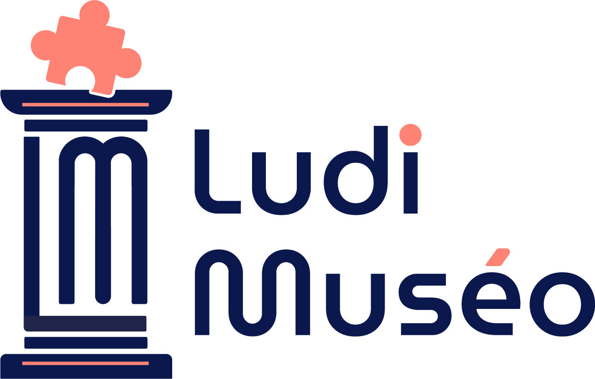
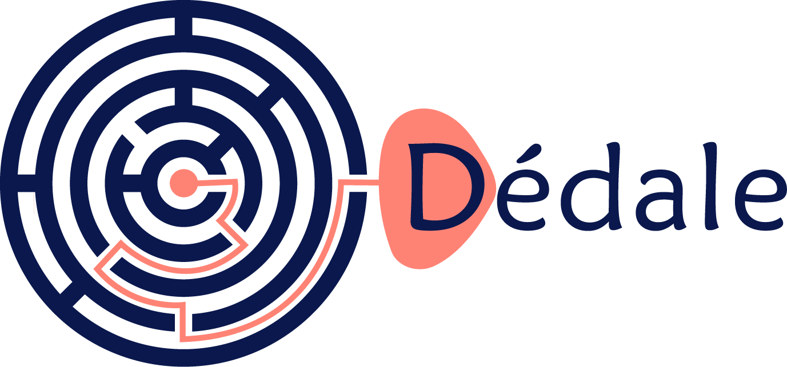

<h2 align="center"> Salut, moi c'est Aurélien👋</h2>
<h4 align="center">Bienvenue sur mon GitHub ! Je suis développeur web et mobile, spécialisé dans la création d'applications performantes et accessibles.
Voici un petit tour d'horizon de ce que je fais et ce que j'apporte....</h4>
 

<h3>🚀 Ce que je fais</h3>

<h4>📊 Mes spécialités</h4>

React & React Native : Pour des interfaces modernes et interactives.

Firebase & Node.js : Des backends robustes pour des applications connectées.

Accessibilité : Inclusivité et expérience utilisateur au cœur de mes projets LudiMuséo.

<h4>🔧 Mes projets phares</h4>

 

Dédale : Une application mobile ludique et éducative pour explorer des lieux culturels, avec un fort accent sur l'accessibilité.

App de recettes : Gestion de favoris, portions adaptées, et navigation fluide entre les recettes.

Système e-commerce : Une application web pour gérer des produits et un panier dynamique, déployée sur Vercel.

<h3>📚 Ce qui m'inspire</h3>

L'innovation : Créer des solutions uniques pour répondre à des besoins spécifiques.

L'apprentissage continu : Toujours explorer de nouvelles technologies et améliorer mes compétences.

L'impact positif : Rendre le numérique accessible à tous.

<h3>😎 Fun fact</h3>

Avant d'être développeur, j'ai voyagé entre les tatamis, la sécurité, la plannification, et le management d'équipe – un parcours atypique qui m'aide à garder discipline et focus.

